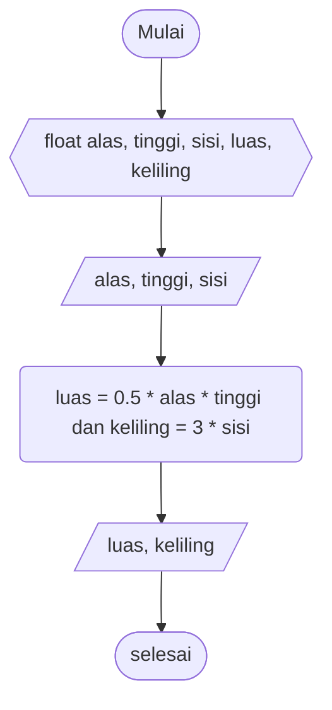

# Pseudocode Luas Segitiga #

Deklarasi float alas, tinggi, sisi, luas, keliling

print "alas"\
input nilai alas
print "tinggi"
input nilai tinggi

luas = 0.5 * alas * tinggi
keliling = 3 * sisi 

print "luas" dan "keliling"

# Flowchart Luas dan Keliling Segitiga #

